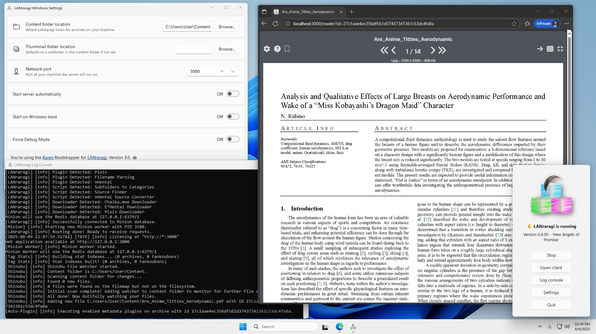

# Karen
Windows Bootstrapper for LANraragi using WSL.  
Works on Windows 10 1809 and up. (1803 works but isn't recommended due to poor control on terminating Linux processes.)  

* Start/Stop LRR from a Windows-based UI
* Show/hide log console on a click
* Options to set content folder and listen port

